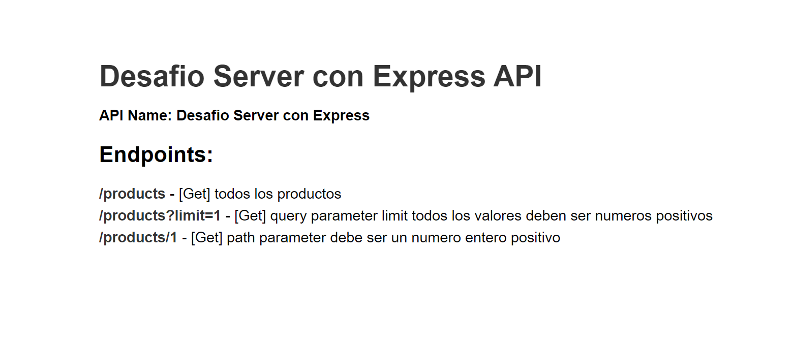

# Desafio Server con Express API 

# Configuración
> pasos para ejecutar el proyecto


* Instalar dependencias 
> `npm install` de las dependencias estando dentro del path del proyecto.

```
> full-stack-coderhouse-c43395\desafios\Servidor con Express> npm install

up to date, audited 75 packages in 606ms

10 packages are looking for funding
  run `npm fund` for details

found 0 vulnerabilities
PS D:\CURSOS\full-stack-coderhouse-c43395\desafios\Servidor con Express> 

```

* Ejecucion
> si el equipo cuenta con nodemon entoces ejecutar `npm run test` estando dentro del path del proyecto.

```
> full-stack-coderhouse-c43395\desafios\Servidor con Express> npm run test

> express-app@1.0.0 test
> nodemon src/app.js

[nodemon] 3.0.1
[nodemon] to restart at any time, enter `rs`
[nodemon] watching path(s): *.*
[nodemon] watching extensions: js,mjs,cjs,json
[nodemon] starting `node src/app.js`
Server run on port: 8080
```

# HTTP ENDPOINTS
### Root de la app 

[http://localhost:8080/](http://localhost:8080/)



### /products GET: path parameter y query parameters

[http://localhost:8080/products](http://localhost:8080/products)


```
// 20230715195357
// http://localhost:8080/products

[
  {
    "id": 1,
    "title": "producto 1",
    "description": "detalle de producto",
    "thumbnail": "Sin imagen",
    "code": "abc123",
    "stock": 15,
    "price": 100
  },
  {
    "id": 2,
    "title": "producto 2",
    "description": "detalle de producto",
    "thumbnail": "Sin imagen",
    "code": "abc123",
    "stock": 25,
    "price": 200
  },
  {
    "id": 3,
    "title": "alto update perri",
    "description": "12321",
    "thumbnail": "Sin imagen",
    "code": "12321",
    "stock": 25,
    "price": 200000000
  },
  {
    "id": 4,
    "title": "producto 4",
    "description": "detalle de producto",
    "thumbnail": "Sin imagen",
    "code": "abc123",
    "stock": 45,
    "price": 400
  }
]
```

[http://localhost:8080/products?limit=1](http://localhost:8080/products?limit=1)

```
// 20230715195418
// http://localhost:8080/products?limit=1

[
  {
    "id": 1,
    "title": "producto 1",
    "description": "detalle de producto",
    "thumbnail": "Sin imagen",
    "code": "abc123",
    "stock": 15,
    "price": 100
  }
]
```

[http://localhost:8080/products/1](http://localhost:8080/products/1)

```
// 20230715195439
// http://localhost:8080/products/1

[
  {
    "id": 1,
    "title": "producto 1",
    "description": "detalle de producto",
    "thumbnail": "Sin imagen",
    "code": "abc123",
    "stock": 15,
    "price": 100
  }
]
```